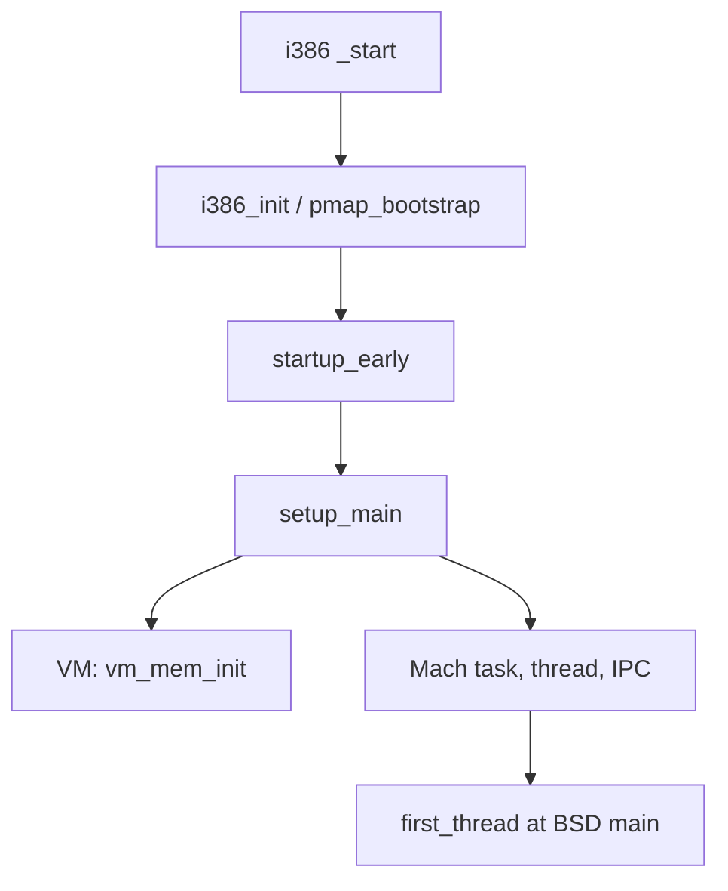
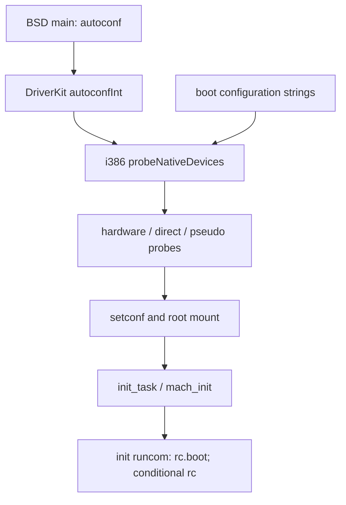

# i386 boot path: source-grounded trace

## Scope and reading guide

This is a current-tree i386 trace from the loader's kernel transfer through the start of the rc scripts. It separates verified calls from conclusions dependent on build or installed configuration; [the source map](boot-source-map.md) is the shared evidence index. **Source anchor:** `src/boot-2/i386/boot2/boot.c` `execKernel()`; `src/Commands/system_cmds/init.tproj/init.c` `runcom()`.

“Verified” is a named source-level call, symbol, pathname, or control-flow relationship. “Inferred” joins verified adjacent facts. A “Research gap” is deliberately not filled with historical assumptions. **Source anchor:** `docs/boot-source-map.md` “Evidence levels”.

`i386 loader → kernel _start`: `execKernel()` passes `kernelEntry` to `startprog()`; `_startprog` loads that offset and executes `lret`, while `_start` documents the loader handoff. **Source anchor:** `src/boot-2/i386/boot2/boot.c` `execKernel()`; `src/boot-2/i386/libsaio/asm.s` `_startprog`; `src/kernel-7/machdep/i386/start.s` `_start`.

`kernel _start → i386_init`: `_start` calls `_i386_init`. **Source anchor:** `src/kernel-7/machdep/i386/start.s` `_start`.

`i386_init → setup_main`: after i386 initialization and a post-paging segment transition, assembly calls `_startup_early` then `_setup_main`. **Source anchor:** `src/kernel-7/machdep/i386/start.s` `vstart`.

`setup_main → BSD main`: `setup_main()` starts `first_thread` at `main` and returns it; assembly passes the result to `start_initial_context()`. **Source anchor:** `src/kernel-7/kern/mach_init.c` `setup_main()`; `src/kernel-7/machdep/i386/start.s` `vstart`.

`BSD main → /sbin/mach_init`: BSD `main()` starts `init_task()`, which calls `load_init_program()`; its initial name is `/sbin/mach_init`. **Source anchor:** `src/kernel-7/bsd/kern/init_main.c` `main()`, `init_task()`; `src/kernel-7/bsd/kern/kern_exec.c` `init_program_name`.

`/sbin/mach_init → /sbin/init`: **Inferred, fallback only.** The dashed edge is taken by the checked-in fallback configuration when `/etc/bootstrap.conf` is unavailable or unparseable; the normal configured service route is a research gap. **Source anchor:** `src/Commands/system_cmds/mach_init.tproj/bootstrap.c` `default_conf`; `src/Commands/system_cmds/mach_init.tproj/parser.c` `init_config()`.

`/sbin/init fallback → rc.boot; conditional rc`: `init` runs `runcom()` in boot-script mode unless disabled. A successful boot-script return leaves the requested run-com transition in place; a failure can set the requested transition to single-user, so `/etc/rc` is a subsequent state-machine path rather than a guaranteed continuation. **Source anchor:** `src/Commands/system_cmds/init.tproj/init.c` `main()`, `runcom()`; `src/Commands/system_cmds/init.tproj/pathnames.h` `_PATH_RUNCOM`.

## Firmware and loader handoff

**Research gap:** no source traced here establishes firmware execution, firmware mode changes, or selection of this loader. The first verified point is `execKernel()`, which obtains `kernelEntry` from `loadprog()` and calls `startprog(kernelEntry)`. **Source anchor:** `src/boot-2/i386/boot2/boot.c` `execKernel()`.

The transfer routine takes an entry offset, sets data segments, pushes selector `0x28` and the offset, and executes `lret`; the kernel says it arrives in protected mode with paging disabled. **Source anchor:** `src/boot-2/i386/libsaio/asm.s` `_startprog`; `src/kernel-7/machdep/i386/start.s` `_start`.

The loader can load a standalone linker and conditionally call `loadBootDrivers()` before transfer. **Inferred:** this is a distinct stage from later kernel DriverKit probing; no one-to-one correspondence is established. **Source anchor:** `src/boot-2/i386/boot2/boot.c` `execKernel()`; `src/kernel-7/driverkit/autoconfCommon.m` `autoconfInt()`.

## Architecture entry and early machine setup

`_start` clears the direction flag, calls `gdt_init` and `idt_init`, far-jumps to the new GDT, and loads data segments. **Source anchor:** `src/kernel-7/machdep/i386/start.s` `_start`, `start1`.

`i386_init()` reads memory values from `KERNBOOTSTRUCT`, zero-fills data, parses arguments, configures the machine and interrupts, sets the VM page size, sizes memory, and creates its memory-region description. **Source anchor:** `src/kernel-7/machdep/i386/i386_init.c` `i386_init()`.

It then calls `pmap_bootstrap()` and relocates GDT/IDT; the following assembly transition documents paging as enabled. **Source anchor:** `src/kernel-7/machdep/i386/i386_init.c` `i386_init()`; `src/kernel-7/machdep/i386/start.s` `vstart`.

## Mach kernel and virtual-memory initialization

`i386 _start → i386_init / pmap_bootstrap`: `_start` calls `_i386_init`, which calls `pmap_bootstrap()`. **Source anchor:** `src/kernel-7/machdep/i386/start.s` `_start`; `src/kernel-7/machdep/i386/i386_init.c` `i386_init()`.

`i386_init / pmap_bootstrap → startup_early`: `_startup_early` is the next direct call after the post-paging transition. **Source anchor:** `src/kernel-7/machdep/i386/start.s` `vstart`.

`startup_early → setup_main`: assembly directly calls `_setup_main` immediately after `_startup_early`. **Source anchor:** `src/kernel-7/machdep/i386/start.s` `vstart`.

`setup_main → VM: vm_mem_init`: `vm_mem_init()` starts VM pages, initializes objects/maps, kernel memory, pmap, zones, and kernel allocation. **Source anchor:** `src/kernel-7/kern/mach_init.c` `setup_main()`; `src/kernel-7/vm/vm_init.c` `vm_mem_init()`.

`setup_main → Mach task, thread, IPC`: it initializes scheduler/clock support, then task, thread, swapper, IPC, and vnode pager subsystems. **Source anchor:** `src/kernel-7/kern/mach_init.c` `setup_main()`.

`Mach task, thread, IPC → first_thread at BSD main`: it creates, starts, makes runnable, and returns `first_thread`; the i386 caller then invokes `start_initial_context()`. **Source anchor:** `src/kernel-7/kern/mach_init.c` `setup_main()`; `src/kernel-7/machdep/i386/start.s` `vstart`; `src/kernel-7/machdep/i386/pcb.c` `start_initial_context()`.

## BSD initialization and root filesystem

BSD `main()` establishes process zero and initializes kernel memory, process structures, credentials, descriptors, filesystems, mbufs, logging, interfaces, sockets, and protocol domains. **Source anchor:** `src/kernel-7/bsd/kern/init_main.c` `main()`.

After its conditional DriverKit work, `main()` calls `setconf()` and retries `vfs_mountroot()` until success, marks the first mount root, and obtains the root vnode through `VFS_ROOT`. **Source anchor:** `src/kernel-7/bsd/kern/init_main.c` `main()`.

For i386, `setconf()` validates the boot structure and selects or asks for a root device using `sd`, `hd`, `fd`, `en`, and `tr` generic prefixes. `vfs_mountroot()` uses a selected mount routine or tries registered filesystem routines. **Source anchor:** `src/kernel-7/machdep/i386/swapgeneric.m` `setconf()`, `genericconf`; `src/kernel-7/bsd/vfs/vfs_subr.c` `vfs_mountroot()`.

**Research gap:** this does not prove a concrete root device, filesystem, or mount result for an installed system. **Source anchor:** `src/kernel-7/machdep/i386/swapgeneric.m` `setconf()`; `src/kernel-7/bsd/vfs/vfs_subr.c` `vfs_mountroot()`.

## DriverKit, drivers, and service activation

`BSD main: autoconf → DriverKit autoconfInt`: with `DRIVERKIT`, BSD `main()` calls `autoconf()`; it initializes I/O support, starts `autoconfInt` in the I/O task, and waits. **Source anchor:** `src/kernel-7/bsd/kern/init_main.c` `main()`; `src/kernel-7/driverkit/autoconfCommon.m` `autoconf()` (lines 103–105).

`DriverKit autoconfInt → i386 probeNativeDevices`: `autoconfInt()` registers indirect classes and then directly calls `probeNativeDevices()` before the later hardware, direct, and pseudo-device probes. **Source anchor:** `src/kernel-7/driverkit/autoconfCommon.m` `autoconfInt()` (lines 293–321).

`boot configuration strings → i386 probeNativeDevices`: `findBootConfigString()` reads null-separated `KERNBOOTSTRUCT.config` entries; `probeNativeDevices()` initializes boot-loaded drivers and processes those configuration tables. **Source anchor:** `src/kernel-7/driverkit/i386/autoconf_i386.m` `findBootConfigString()`, `probeNativeDevices()`.

`i386 probeNativeDevices → hardware / direct / pseudo probes`: after the native probe returns, `autoconfInt()` calls `probeHardware()`, `probeDirectDevices()`, and `probePseudoDevices()` in that order. **Source anchor:** `src/kernel-7/driverkit/autoconfCommon.m` `autoconfInt()` (lines 293–321).

`hardware / direct / pseudo probes → setconf and root mount`: `autoconf()` waits until `autoconfInt()` signals completion; the `main()` source then proceeds from its `autoconf()` call to its root-mount loop. **Source anchor:** `src/kernel-7/driverkit/autoconfCommon.m` `autoconf()` (lines 103–105), `autoconfInt()` (lines 324–328); `src/kernel-7/bsd/kern/init_main.c` `main()`.

`setconf and root mount → init_task / mach_init`: after root vnode setup, `main()` resumes a thread at `init_task()`, which invokes `load_init_program()`. **Source anchor:** `src/kernel-7/bsd/kern/init_main.c` `main()`, `init_task()`.

`init_task / mach_init → init runcom: rc.boot; conditional rc`: **Inferred.** The kernel first executes `/sbin/mach_init`; the fallback names `/sbin/init`, whose state machine can run the run-com paths, but installed configuration and a successful transition to normal `/etc/rc` are unproven. **Source anchor:** `src/kernel-7/bsd/kern/kern_exec.c` `load_init_program()`; `src/Commands/system_cmds/mach_init.tproj/bootstrap.c` `default_conf`; `src/Commands/system_cmds/init.tproj/init.c` `runcom()`.

The i386 native probe says it currently initializes devices enumerated in configuration tables; its hardware and direct probe functions are empty. **Research gap:** the tree does not establish which `src/drivers/` projects are built, boot-loaded, or selected for a target configuration. **Source anchor:** `src/kernel-7/driverkit/i386/autoconf_i386.m` `probeNativeDevices()`, `probeHardware()`, `probeDirectDevices()`; `src/drivers/`.

## First user-space process and the rc boundary

`init_task()` invokes `load_init_program()` and then returns through `thread_exception_return()`. That loader starts with `/sbin/mach_init`, builds a synthetic `execve` request, and can later try `/etc/mach_init` after a failure. **Source anchor:** `src/kernel-7/bsd/kern/init_main.c` `init_task()`; `src/kernel-7/bsd/kern/kern_exec.c` `init_program_name`, `load_init_program()`.

`mach_init` parses `/etc/bootstrap.conf` when possible, otherwise the fallback names `/sbin/init`. **Research gap:** no installed `/etc/bootstrap.conf` was located, so normal service selection and a guaranteed transition to `/sbin/init` cannot be asserted. **Source anchor:** `src/Commands/system_cmds/mach_init.tproj/bootstrap.c` `CONF_FILE`, `default_conf`; `src/Commands/system_cmds/mach_init.tproj/parser.c` `init_config()`.

`init` calls `runcom()` in boot-script mode by default. A boot-script failure changes the requested transition to single-user; only the subsequent state-machine run-com transition selects `/etc/rc`. Each `runcom()` invocation uses the Bourne shell, with `/etc/rc.boot` in boot-script mode and `/etc/rc` otherwise. **Source anchor:** `src/Commands/system_cmds/init.tproj/init.c` `main()`, `runcom()`; `src/Commands/system_cmds/init.tproj/pathnames.h` `_PATH_RUNCOM`, `_PATH_RUNCOM_BOOT`.

The checked-in `rc.boot` prepares single-user operation and performs filesystem checks except in its special cases; the checked-in `rc` is multi-user startup and runs eligible `/etc/startup` scripts. This trace ends at that rc boundary. **Source anchor:** `src/files-5/private/etc/rc.boot`; `src/files-5/private/etc/rc`.

## Evidence and research gaps

Verified spine: `_start → i386_init → startup_early → setup_main → first_thread at BSD main → init_task → load_init_program → execve(/sbin/mach_init)`. **Source anchor:** `src/kernel-7/machdep/i386/start.s` `vstart`; `src/kernel-7/kern/mach_init.c` `setup_main()`; `src/kernel-7/bsd/kern/init_main.c` `init_task()`; `src/kernel-7/bsd/kern/kern_exec.c` `load_init_program()`.

Remaining gaps are firmware-to-loader provenance, installed driver selection, concrete root mount, and installed bootstrap configuration/normal init-server route. **Source anchor:** `src/boot-2/i386/boot2/boot.c` `execKernel()`; `src/kernel-7/driverkit/i386/autoconf_i386.m` `probeNativeDevices()`; `src/kernel-7/machdep/i386/swapgeneric.m` `setconf()`; `src/Commands/system_cmds/mach_init.tproj/parser.c` `init_config()`.
