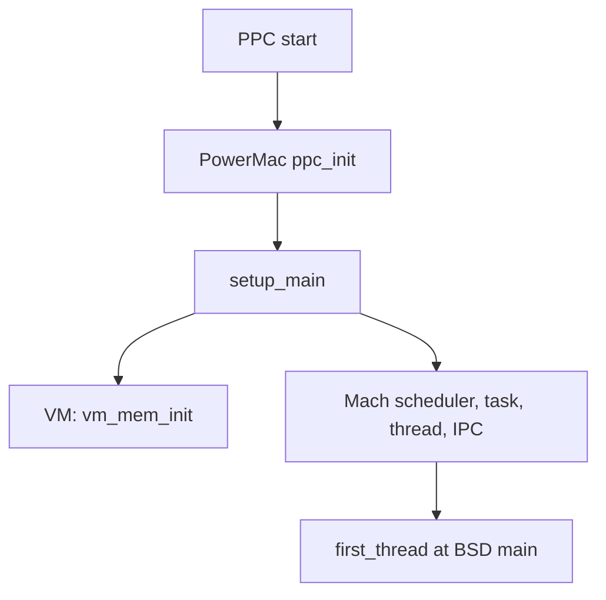
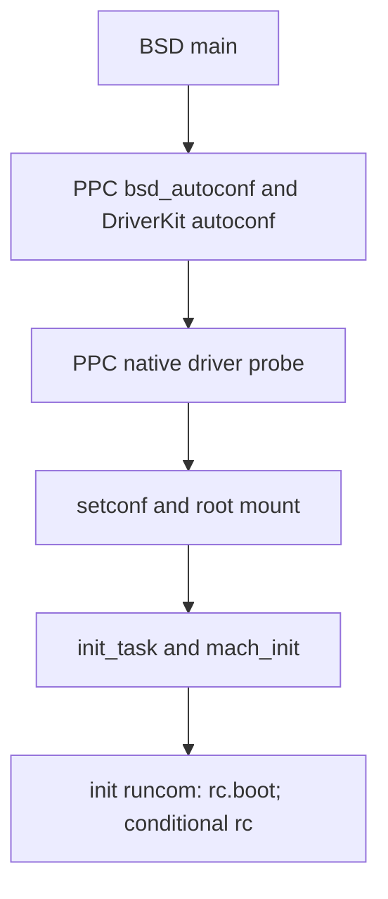

# PPC boot path: source-grounded trace

## Scope and reading guide

This is a current-tree PPC trace from the checked-in SecondaryLoader transfer through the beginning of the run-com scripts. It distinguishes named source relationships from conclusions that depend on the PowerMac implementation being linked into a particular boot image or on an installed configuration. **Source anchor:** `src/boot-2/ppc/SecondaryLoader/SecondaryInAsm.s` `TryPartition`; `src/drivers/ppc/bus/drvPExpert/powermac/powermac_init.c` `ppc_init`; `src/Commands/system_cmds/init.tproj/init.c` `runcom()`.

“Verified” means the cited source names a symbol, direct call, branch, pathname, or control-flow relationship. “Inferred” joins verified adjacent facts. “Research gap” is an explicitly bounded missing fact, not a historical reconstruction. **Source anchor:** `docs/boot-source-map.md` “Evidence levels”.

`SecondaryLoader → PPC start`: **Inferred.** The loader transfers to `loadBase`, while the kernel comment describes `start` as the address jumped to after the SecondaryLoader loads the Mach-O image; the image-to-`start` linkage itself is not established by a traced loader build/load path. **Source anchor:** `src/boot-2/ppc/SecondaryLoader/SecondaryInAsm.s` `TryPartition`; `src/kernel-7/machdep/ppc/start.s` `start` comment.

`PPC start → PowerMac ppc_init`: `start` directly branches-and-links to `ppc_init`; `src/drivers/ppc/bus/drvPExpert/powermac/powermac_init.c` defines that function and identifies it as the first function called from `start.s`. The PPC kernel configuration selects `pexpertpowermac.o`, the PPC link suffix includes that Platform Expert object, and the PowerMac project builds that product from `powermac_init.c`. **Verified for the checked-in build and source relationship.** The remaining uncertainty is whether a particular loaded kernel image was built from this configuration and artifact. **Source anchor:** `src/kernel-7/machdep/ppc/start.s` `start`; `src/kernel-7/conf/MASTER.ppc` `LIBPEXPERT`; `src/kernel-7/conf/Makefile.ppc` `LDOBJS_SUFFIX`; `src/drivers/ppc/bus/drvPExpert/powermac/Makefile.preamble` `PRODUCT`; `src/drivers/ppc/bus/drvPExpert/powermac/Makefile` `CFILES`; `src/drivers/ppc/bus/drvPExpert/powermac/powermac_init.c` `ppc_init`.

`shared Mach/BSD sequence → /sbin/mach_init`: **Verified for the checked-in PowerMac build and source chain.** PowerMac `ppc_init()` calls `setup_main()` and passes its returned thread to `start_initial_context()`; `setup_main()` creates `first_thread` at BSD `main`; BSD `main()` starts `init_task()`, which calls `load_init_program()` for `/sbin/mach_init`. The remaining uncertainty is only whether a particular loaded kernel image was built from the configuration that selects this artifact. **Source anchor:** `src/kernel-7/conf/MASTER.ppc` `LIBPEXPERT`; `src/kernel-7/conf/Makefile.ppc` `LDOBJS_SUFFIX`; `src/drivers/ppc/bus/drvPExpert/powermac/Makefile.preamble` `PRODUCT`; `src/drivers/ppc/bus/drvPExpert/powermac/Makefile` `CFILES`; `src/drivers/ppc/bus/drvPExpert/powermac/powermac_init.c` `ppc_init`; `src/kernel-7/kern/mach_init.c` `setup_main()`; `src/kernel-7/bsd/kern/init_main.c` `main()`, `init_task()`; `src/kernel-7/bsd/kern/kern_exec.c` `init_program_name`.

`/sbin/mach_init → rc boundary`: **Inferred.** The checked-in fallback configuration selects `/sbin/init` if `/etc/bootstrap.conf` cannot be opened or parsed; `init` owns the run-com transition. Installed bootstrap configuration remains untraced. **Source anchor:** `src/Commands/system_cmds/mach_init.tproj/bootstrap.c` `default_conf`; `src/Commands/system_cmds/mach_init.tproj/parser.c` `init_config()`; `src/Commands/system_cmds/init.tproj/init.c` `runcom()`.

## Firmware and loader handoff

The kernel entry comment says that Open Firmware loaded `SecondaryLoader`, which loaded a Mach-O `MH_PRELOAD` image and jumped to `start`; it also records expected supervisor mode, translations off, and `ARG0` as startup parameters. **Research gap:** this comment does not independently verify firmware selection, the loaded file’s identity, or the build path that ties the image entry to `start`. **Source anchor:** `src/kernel-7/machdep/ppc/start.s` `start` comment.

At the verified loader transfer point, `TryPartition` obtains `loadBase`, passes disk handle, partition number, client-interface pointer, load base, and load size in `r3`–`r7`, makes `r6` the count-register target, and executes `bctrl`. A return is treated as a next-stage error. **Source anchor:** `src/boot-2/ppc/SecondaryLoader/SecondaryInAsm.s` `GetLoadBase`, `TryPartition`.

## Architecture entry and early machine setup

`start` conditionally normalizes MSR state, initializes floating-point registers, turns virtual memory off in MSR, selects `intstack_top_ss` as its stack, and invokes `ppc_init`. **Source anchor:** `src/kernel-7/machdep/ppc/start.s` `start`.

The checked-in PowerMac PExpert implementation of `ppc_init` copies and parses boot arguments, optionally initializes the device tree, identifies the machine, initializes processor state, serial and screen output, VM, debugger, platform state, and interrupts, then calls `setup_main()` and passes its returned thread to `start_initial_context()`. **Source anchor:** `src/drivers/ppc/bus/drvPExpert/powermac/powermac_init.c` `ppc_init`, `initialize_vm()`.

**Research gap:** the checked-in PPC configuration and build metadata select and link the PowerMac PExpert object, but they do not prove that a particular loaded kernel image was built from that configuration or contains the resulting artifact. Machine-specific behavior behind indirect `powermac_init_p` callbacks likewise depends on the selected platform implementation. **Source anchor:** `src/kernel-7/conf/MASTER.ppc` `LIBPEXPERT`; `src/kernel-7/conf/Makefile.ppc` `LDOBJS_SUFFIX`; `src/drivers/ppc/bus/drvPExpert/powermac/Makefile.preamble` `PRODUCT`; `src/drivers/ppc/bus/drvPExpert/powermac/Makefile` `CFILES`; `src/drivers/ppc/bus/drvPExpert/powermac/powermac_init.c` `initialize_processors()`, `configure_platform()`.

## Mach kernel and virtual-memory initialization

`PPC start → PowerMac ppc_init`: `start` directly calls `ppc_init`; the checked-in PowerMac PExpert source defines `ppc_init`. **Source anchor:** `src/kernel-7/machdep/ppc/start.s` `start`; `src/drivers/ppc/bus/drvPExpert/powermac/powermac_init.c` `ppc_init`.

`PowerMac ppc_init → setup_main`: `ppc_init()` directly assigns the result of `setup_main()` to `t`, then calls `start_initial_context(t)`. The checked-in PPC configuration selects and links the PowerMac PExpert object that is built from this source. **Verified for the checked-in PowerMac build and implementation.** The remaining gap is whether a particular loaded image uses that configured artifact. **Source anchor:** `src/drivers/ppc/bus/drvPExpert/powermac/powermac_init.c` `ppc_init`; `src/kernel-7/conf/MASTER.ppc` `LIBPEXPERT`; `src/kernel-7/conf/Makefile.ppc` `LDOBJS_SUFFIX`; `src/drivers/ppc/bus/drvPExpert/powermac/Makefile.preamble` `PRODUCT`; `src/drivers/ppc/bus/drvPExpert/powermac/Makefile` `CFILES`.

`setup_main → VM: vm_mem_init`: `setup_main()` directly calls `vm_mem_init()`. That routine starts VM pages, then initializes zones, objects, maps, kernel memory, and the pmap. **Source anchor:** `src/kernel-7/kern/mach_init.c` `setup_main()`; `src/kernel-7/vm/vm_init.c` `vm_mem_init()`.

`setup_main → Mach scheduler, task, thread, IPC`: `setup_main()` initializes the machine clock and scheduler, then task, thread, swapper, IPC, and vnode-pager subsystems. **Source anchor:** `src/kernel-7/kern/mach_init.c` `setup_main()`.

`Mach scheduler, task, thread, IPC → first_thread at BSD main`: `setup_main()` creates `first_thread`, starts it at `main`, makes it runnable, and returns it. The checked-in PowerMac `ppc_init()` passes its `setup_main()` result to PPC `start_initial_context()`, which activates the thread map and calls `load_context()`. **Source anchor:** `src/kernel-7/kern/mach_init.c` `setup_main()`; `src/drivers/ppc/bus/drvPExpert/powermac/powermac_init.c` `ppc_init`; `src/kernel-7/machdep/ppc/pcb.c` `start_initial_context()`.

## BSD initialization and root filesystem

The checked-in PowerMac `ppc_init()` calls `setup_main()` and transfers its returned first thread through `start_initial_context()`. `setup_main()` starts that thread at common BSD `main()`, which initializes process, filesystem, networking, socket, and protocol state before its DriverKit and root-mount work. **Verified for this checked-in build and source chain; unverified only for a particular loaded image.** **Source anchor:** `src/kernel-7/conf/MASTER.ppc` `LIBPEXPERT`; `src/kernel-7/conf/Makefile.ppc` `LDOBJS_SUFFIX`; `src/drivers/ppc/bus/drvPExpert/powermac/Makefile.preamble` `PRODUCT`; `src/drivers/ppc/bus/drvPExpert/powermac/Makefile` `CFILES`; `src/drivers/ppc/bus/drvPExpert/powermac/powermac_init.c` `ppc_init`; `src/kernel-7/kern/mach_init.c` `setup_main()`; `src/kernel-7/bsd/kern/init_main.c` `main()`.

After autoconfiguration, `main()` calls `setconf()` and retries `vfs_mountroot()` until it succeeds, marks the first mount as the root filesystem, and obtains the root vnode through `VFS_ROOT`. **Source anchor:** `src/kernel-7/bsd/kern/init_main.c` `main()`.

PPC `setconf()` consults `rootdevice`, then Open Firmware `/chosen` `rootpath`, then `/options` `boot-file`; when it has a value it dealiases the path and searches for a device. **Source anchor:** `src/kernel-7/machdep/ppc/swapgeneric.m` `setconf()`.

**Research gap:** these sources do not establish a concrete root device, filesystem, selected mount routine, or successful mount for an installed target. **Source anchor:** `src/kernel-7/machdep/ppc/swapgeneric.m` `setconf()`; `src/kernel-7/bsd/kern/init_main.c` `main()`.

## DriverKit, drivers, and service activation

`BSD main → PPC bsd_autoconf and DriverKit autoconf`: when `DRIVERKIT` is defined, PPC-specific conditional code calls `bsd_autoconf()` before `autoconf()`; `bsd_autoconf()` contains only a GDB/PowerSurge-gated `mace_init()` call. **Source anchor:** `src/kernel-7/bsd/kern/init_main.c` `main()`; `src/kernel-7/machdep/ppc/swapgeneric.m` `bsd_autoconf()`.

`PPC bsd_autoconf and DriverKit autoconf → PPC native driver probe`: `autoconf()` starts `autoconfInt` in the I/O task and waits; `autoconfInt()` calls `probeNativeDevices()` before hardware, direct, and pseudo-device probes. PPC `probeNativeDevices()` first calls `bootDriverInit()` and then processes boot configuration tables. **Source anchor:** `src/kernel-7/driverkit/autoconfCommon.m` `autoconf()`, `autoconfInt()`; `src/kernel-7/driverkit/ppc/autoconf_ppc.m` `probeNativeDevices()`.

`PPC native driver probe → setconf and root mount`: after `autoconf()` returns, the common `main()` proceeds to the root-mount loop. **Source anchor:** `src/kernel-7/driverkit/autoconfCommon.m` `autoconf()`; `src/kernel-7/bsd/kern/init_main.c` `main()`.

`setconf and root mount → init_task and mach_init`: after root-vnode setup, `main()` starts and resumes a thread at `init_task()`; `init_task()` calls `load_init_program()`. **Source anchor:** `src/kernel-7/bsd/kern/init_main.c` `main()`, `init_task()`.

`init_task and mach_init → init runcom: rc.boot; conditional rc`: **Inferred.** The kernel first names `/sbin/mach_init`; its checked-in fallback selects `/sbin/init`, which can execute run-com paths. A normal installed bootstrap route and a successful normal-mode transition are unverified. **Source anchor:** `src/kernel-7/bsd/kern/kern_exec.c` `init_program_name`, `load_init_program()`; `src/Commands/system_cmds/mach_init.tproj/bootstrap.c` `default_conf`; `src/Commands/system_cmds/init.tproj/init.c` `runcom()`.

**Research gap:** source under `src/drivers/` does not by itself prove which projects are built, boot-loaded, selected by configuration tables, or activated on a particular PPC machine. **Source anchor:** `src/drivers/`; `src/kernel-7/driverkit/ppc/autoconf_ppc.m` `probeNativeDevices()`.

## First user-space process and the rc boundary

`init_task()` calls `load_init_program()`. The loader initializes its first program name as `/sbin/mach_init`, constructs the exec request, and can try `/etc/mach_init` after a failed first load. **Source anchor:** `src/kernel-7/bsd/kern/init_main.c` `init_task()`; `src/kernel-7/bsd/kern/kern_exec.c` `init_program_name`, `load_init_program()`.

`mach_init` parses `/etc/bootstrap.conf` when it can; otherwise its fallback configuration names `/sbin/init`. **Research gap:** no installed `bootstrap.conf` was established, so the ordinary configured service selection is not claimed. **Source anchor:** `src/Commands/system_cmds/mach_init.tproj/bootstrap.c` `CONF_FILE`, `default_conf`; `src/Commands/system_cmds/mach_init.tproj/parser.c` `init_config()`.

`init` calls `runcom()` in boot-script mode by default. Its state machine selects `/etc/rc.boot` in boot-script mode and `/etc/rc` otherwise, executing the selected script through the Bourne shell; a boot-script failure can request single-user mode, so normal `/etc/rc` is conditional. **Source anchor:** `src/Commands/system_cmds/init.tproj/init.c` `main()`, `runcom()`; `src/Commands/system_cmds/init.tproj/pathnames.h` `_PATH_RUNCOM`, `_PATH_RUNCOM_BOOT`.

The checked-in `rc.boot` begins early filesystem checks, while `rc` is multi-user startup and runs eligible `/etc/startup` scripts. This trace ends at that rc boundary. **Source anchor:** `src/files-5/private/etc/rc.boot`; `src/files-5/private/etc/rc`.

## Evidence and research gaps

Verified PPC spine: SecondaryLoader prepares `r3`–`r7`, targets `loadBase`, and executes `bctrl`; kernel `start` sets early processor state and directly calls `ppc_init`. **Source anchor:** `src/boot-2/ppc/SecondaryLoader/SecondaryInAsm.s` `TryPartition`; `src/kernel-7/machdep/ppc/start.s` `start`.

The material PPC gap is not a missing `ppc_init` definition or a missing checked-in build selection: the PowerMac PExpert source supplies it, its project builds `pexpertpowermac.o` from `powermac_init.c`, and the PPC kernel configuration links that object. What remains unverified is whether a particular loaded kernel image was built from that configuration and artifact, along with the precise loaded-image-to-`start` binding, installed driver selection, concrete root mount, and installed bootstrap configuration. **Source anchor:** `src/kernel-7/conf/MASTER.ppc` `LIBPEXPERT`; `src/kernel-7/conf/Makefile.ppc` `LDOBJS_SUFFIX`; `src/drivers/ppc/bus/drvPExpert/powermac/Makefile.preamble` `PRODUCT`; `src/drivers/ppc/bus/drvPExpert/powermac/Makefile` `CFILES`; `src/drivers/ppc/bus/drvPExpert/powermac/powermac_init.c` `ppc_init`; `docs/boot-source-map.md` “Architecture entry”, “Drivers”, “Root filesystem”, “First user process”.
