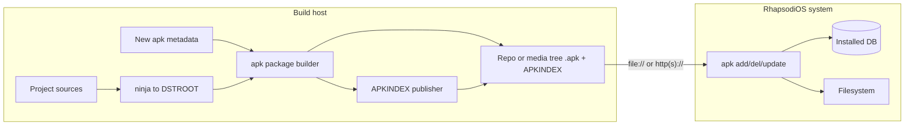

# RhapsodiOS apk package management design

**Date:** 2026-07-19  
**Status:** Approved for implementation planning  
**Replaces:** Debian dpkg / `.deb` as the runtime package manager and distribution format

## Summary

RhapsodiOS will use Alpine **apk-tools 2.0_pre11** (vendored at a fixed commit) for live package install/remove/upgrade and for distributing prebuilt packages. The ninja → shared `DSTROOT` build path remains the compile/stage mechanism; apk owns packaging, publishing, dependency solving, and runtime installation. Per-project `dpkg/control` metadata is replaced entirely by apk-style metadata (no dual-write).

## Goals

1. **Runtime management:** Install, remove, and upgrade packages on a live RhapsodiOS system with **full automatic dependency resolution**.
2. **Distribution:** Publish prebuilt packages as a repo directory usable from **network HTTP(S)** and **local/media** (`file://`, CD/ISO/USB) from day one, using the same tree layout.
3. **Format cutover:** Replace `.deb` / `dpkg/control` with apk packages, indexes, and new per-project metadata.

## Non-goals (v1)

- Replacing ninja/make or the shared-`DSTROOT` build model.
- Keeping dpkg as a parallel runtime package manager.
- rpm, yum, or a C “yum” port.
- GUI or interactive `dselect`-style front-ends.
- Third-party repo ranking or automatic rebuild-from-source.
- Automated dpkg → apk migration for existing installed systems (rebuild/reinstall from apk seed).
- Tracking or rebasing onto modern apk-tools (meson, lua, newer index formats) unless deliberately decided later.
- Full-world package rebuild CI and signed-repo verification matrices in v1 tests.

## Context

- Historical packaging used Debian dpkg (GPL-2 Darwin port) and `*/dpkg/control`; legacy Perl builders produced `.deb`s in chroots.
- The ninja/samurai orchestration layer already builds into a shared `DSTROOT` without producing `.deb`s, but still reads `dpkg/control` for identity and build dependencies.
- The OS is Rhapsody/Darwin (Mach+BSD, Apple Libc, `ppc` + `i386`), not Alpine/musl/BusyBox. apk must be ported to this userspace.

## Decision

**Adopt older apk-tools (approach chosen over rpm+yum-in-C and a from-scratch apk-like tool).**

| Option | Verdict |
|--------|---------|
| Older rpm + C yum-like solver | Rejected: heavy Darwin port; solver/repo layer is a second large project; overkill for this package set. |
| **Older apk-tools** | **Chosen:** C already, solver + fetch + local/media, simple packages/indexes for distribution. |
| Purpose-built apk-like tool | Escape hatch only if the Darwin port of vendored apk proves intractable. |

## Vendor pin

- **Upstream:** [alpinelinux/apk-tools](https://github.com/alpinelinux/apk-tools)
- **Commit:** `72f25038747e54e820941704c0d1cdc6aef3445f`
- **Tag/message:** `apk-tools-2.0_pre11` (2009-05-06)
- **License:** GPL-2.0
- **Tree location:** `src/apk-tools/` (vendored copy)
- **Policy:** Freeze at this SHA. RhapsodiOS/Darwin fixes are **local patches** on that tree (Apple-style makefiles, zlib link path, drop or adjust Linux-only flags such as `-nopie` / `_GNU_SOURCE` as needed, DB/path layout, fetch/TLS wiring). Do not silently track upstream HEAD.

This revision already provides the commands needed for v1: `add`, `del`, `update`, `info`, `search`, `ver`, `index`, `fetch`, `audit` (and related). There is no separate `upgrade` applet; upgrades are `apk add --upgrade` / `-u`. Root override is `--root` / `-p` or the `ROOT` environment variable. Packaging and index invocation follow this tree’s CLI, not modern apk-tools.

## Architecture

**Layers:**

1. **Metadata** — Per-project apk-style package definition (replaces `dpkg/control`).
2. **Build/stage** — Existing ninja → shared `DSTROOT`.
3. **Package** — Staged files + metadata → `.apk`.
4. **Publish** — Repo directory with `.apk` files and `APKINDEX`; copy to media or serve over HTTP(S).
5. **Runtime** — Ported `apk` on the OS: solve, fetch or read local, install/remove/upgrade, maintain installed DB.

## Components

### 1. Vendored `apk` (runtime)

- Source under `src/apk-tools/` at the pinned commit, built with **Apple/NeXT-style makefiles** (aligned with the rest of the tree), not upstream’s kbuild-style `Make.rules` as the long-term interface.
- Link against the tree’s **zlib** (replace upstream’s hardcoded `/usr/lib/libz.a`).
- Day-one commands: `update`, `add`, `del`, `info`, `search`, `index`, `fetch`; upgrades via `apk add --upgrade` / `-u`.
- Installed-package database at **`/lib/apk`** (Alpine pre11 convention; keep unless the Darwin port forces a documented relocation).
- Config: `/etc/apk/repositories` lists `http(s)://` and/or `file://` roots.

### 2. Package metadata (replaces `dpkg/control`)

- One human-edited definition per project at **`apk/PKGINFO`** beside the project sources: name, version, architecture, dependencies / provides / conflicts, plus a clear mapping of which `DSTROOT` paths belong to the package (file list or install-root convention documented in the implementation plan).
- The builder embeds this as the `.PKGINFO` inside the `.apk` (apk-tools package metadata). Do **not** adopt Alpine `APKBUILD`/abuild as a dependency; RhapsodiOS packaging is DSTROOT-based, not abuild-based.
- **Single metadata directory per project; two consumers:**
  - **ninja / genninja:** build-time dependencies and package identity (from `apk/PKGINFO` and any small sibling file only if build-deps must be split—prefer one file with distinct build-dep vs runtime-dep fields).
  - **apk:** runtime dependencies embedded in `.apk` and index.

### 3. Package builder (host tooling)

- After ninja install (per project or batch “package world”), produce `.apk` from the project’s `DSTROOT` slice + metadata.
- Runs on the build host; not required inside every project’s make unless that is the cleanest integration point.

### 4. Index / publish

- Build `APKINDEX` (and any companion files pre11 expects) over a directory of `.apk` files.
- That directory is the **unit of distribution**: CD/ISO/USB layout or static HTTP document root.
- Suggested layout: `$REPO/rhapsody/$ARCH/` containing `.apk` files and index.

### 5. Build-graph bridge

- `genninja` (or a sibling) stops parsing `*/dpkg/control` and reads the new metadata for package identity, architecture, and **build** dependencies.
- Runtime dependency enforcement is apk’s job, not ninja’s.

### 6. Bootstrap seed

- Minimal set of `.apk` packages (base system + `apk` itself) so install media or a fresh system can run `apk add` without dpkg.
- New systems bootstrap from the apk seed only.

## Data flow

### Build → package → publish

1. Ninja builds projects into shared `DSTROOT`.
2. Packaging step creates `.apk` from staged files + metadata using vendored apk-tools 2.0_pre11.
3. Artifacts land in the repo root for the target architecture.
4. Index step writes `APKINDEX` into that directory (**write to a temp name, then replace**) so incomplete indexes are never advertised as ready.
5. Copy the directory to install media or serve it with a static HTTP server.

### Runtime (network)

1. Repositories list one or more `http(s)://` roots.
2. `apk update` refreshes indexes into the local cache.
3. `apk add pkg…` solves against installed DB + indexes, fetches missing `.apk`s, unpacks onto `/`, updates DB.

### Runtime (media / local)

1. Same flow with `file://` repository entries pointing at the mounted media or local repo directory.
2. Solver and unpack path identical; no network required.

### Upgrade / remove

- Upgrades use `apk add --upgrade` / `-u` against the same DB + indexes; newer versions come from configured repos (including local). Removal uses `apk del`.

### Cutover from dpkg

- No v1 converter for existing dpkg-installed trees; document rebuild/reinstall from apk media/seed.
- Optional later converter is out of scope for this design.

## Error handling

| Case | Behavior |
|------|----------|
| Unmet dependencies | Abort; clear report; **no partial install** of the requested set; non-zero exit; DB/filesystem unchanged for that transaction. |
| Fetch / missing media | Fail the operation. No custom retry layer beyond what pre11 already does. No silent fallback except trying the next configured repo entry if apk already does so. |
| Corrupt / checksum mismatch | Reject package; do not install. |
| Index/package skew | Fail `update` or `add` with an actionable message. |
| Disk full / file conflicts | Fail the transaction; follow pre11 conflict rules (no automatic overwrite of files owned by another package). |
| Privileges | Mutating ops require root. Read-only ops allowed where pre11 already allows them. |
| Package/index build failure | Fail that build/publish edge only; never publish a half-written `APKINDEX`. |
| Broken/missing `apk` on system | Recover via seed media reinstall; no self-heal via dpkg. |

## Testing

1. **Port / build smoke:** Vendored tree builds with Apple-style makefiles for active `RC_ARCHS` (`ppc`, `i386`), links tree zlib, installs into `DSTROOT`.
2. **Package round-trip:** Fixture → `.apk` → index → `apk add` from `file://` into a disposable root via pre11 `--root` / `-p` (or `ROOT`). Verify files, DB, `apk info`.
3. **Dependency solving:** `A→B→C`; `apk add A` pulls B and C; missing dep fails with no partial install; assert and document `apk del` reverse-dep behavior as implemented in pre11.
4. **Dual delivery:** Same repo via `file://` and HTTP static server; `update` + `add` both succeed.
5. **Conflict / integrity:** Same-file conflict fails; tampered checksum rejected.
6. **Generator bridge:** New metadata parsed for at least one real project; genninja emits a sane build edge.

**Not required for v1:** full-world rebuild CI; signed-repo matrix; automated dpkg→apk conversion tests.

## Relationship to existing tree

| Area | Role after this design |
|------|-------------------------|
| `ninja/`, `genninja` | Build order and `DSTROOT` staging; metadata source switches from `dpkg/control` to apk metadata. |
| `src/dpkg-3/`, `.deb` builders | Retained only until apk flow is validated; not the long-term runtime PM. Removal timing is an implementation concern after validation. |
| Per-project `dpkg/control` | Replaced by new apk metadata; no dual-write period. |
| `zlib` | Build dependency of vendored apk. |

## Success criteria

- A RhapsodiOS system can `apk update` / `apk add` / `apk del` / `apk add -u` with automatic dependency resolution from both a network repo and local/media using the same published tree.
- World (or a defined seed subset) can be packaged as `.apk` + `APKINDEX` from ninja `DSTROOT` output.
- `genninja` no longer requires `dpkg/control` for the migrated metadata format.
- apk-tools at the pinned SHA builds and runs on RhapsodiOS after the Apple makefile / Darwin port.

## Implementation planning note

This document is the **design spec** only. A separate implementation plan (via the writing-plans workflow) should follow user review of this file and cover vendoring, makefile port, metadata schema details, genninja migration order, and seed package set.
