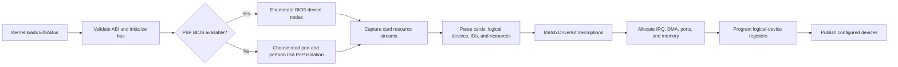

# EISABus binary-first reconstruction design

**Date:** 2026-07-21  
**Status:** Approved  
**Depends on:** `2026-07-21-binrecon-toolkit-design.md`

## Summary

Reconstruct the Rhapsody i386 EISABus kernel server directly from its known-good reference binary. Preserve the reference implementation's ABI, control flow, hardware operations, error behavior, intentional stubs, and build ordering. Eliminate the reconstructed module's kernel crash and restore ISA Plug-and-Play enumeration and configuration in QEMU and on physical Sound Blaster hardware.

Behavioral parity is required first. Byte-identical `EISABus_reloc` is required; byte-identical final `EISABus` is the target. Both image comparisons remain evidence even after runtime success.

## Reference identity

The external reference bundle is supplied at runtime from:

`C:\Users\raynorpat\Downloads\test\Drivers\i386\EISABus.config`

| Artifact | Size | SHA-256 |
|----------|-----:|--------|
| `EISABus` | 25,792 | `8192FDA61EEE306A655966FBFF5FB4FF5E4932C44933B2495ED1121022A0830F` |
| `EISABus_reloc` | 100,752 | `8F252AF66CD49A8E03B51E57E90CB613D0B9DC1602263F4B7B6393E483977B23` |
| `PnPDump` | 59,260 | `006DC6BB73CEBC6243DA669E5199AEC808F309E72C3EE617A3FD8ED310364772` |

The bundle and its IDA database are inputs, not repository content.

## Observed problem

The reconstructed module crashes the kernel and does not correctly detect or configure Plug-and-Play devices. The reference module is reported to work flawlessly on the same physical environment. The checked-in source already mirrors the reference's broad class and method inventory, but it is hand reconstructed and is not accepted until its generated code agrees with the reference.

The reference implementation of `readSystemNode:length:forNode:` returns `NO`; this is intentional reference behavior, not unfinished work.

## Goals

1. Reproduce and localize the reconstructed module's first divergence and kernel fault.
2. Map every reference function, method, selector, global, structure, and section to source and build inputs.
3. Transliterate the implementation function-by-function without redesign.
4. Restore correct ISA PnP discovery, resource parsing, matching, allocation, and device programming.
5. Restore `PnPDump` as the native enumeration and A/B capture tool.
6. Verify in QEMU before installing experimental builds on physical hardware.
7. Match `EISABus_reloc` byte-for-byte and pursue byte-identical final `EISABus`.

## Non-goals

- Redesign or modernize the EISA/ISA PnP architecture.
- Add PnP BIOS functionality absent from the reference.
- Fix reference quirks during parity work.
- Modify unrelated bus, audio, or QEMU code without evidence of an external interface mismatch.
- Commit proprietary binaries, IDA databases, crash dumps containing sensitive data, or machine-local paths in executable configuration.

## Reconstruction rule

The reference implementation takes precedence over elegance. Preserve:

- Integer widths, signedness, casts, stack behavior, and calling conventions.
- Objective-C instance-variable order, method signatures, message-send order, and collection key representation.
- Structure packing, buffer sizes, allocation/free sizes, and ownership transitions.
- Branch ordering, retry behavior, cleanup order, and error returns.
- Port-write ordering, access widths, delays/barriers, initiation keys, isolation checksums, and register programming.
- Source compilation order, link order, sections, padding, and post-link processing.

Unrelated cleanup and refactoring are excluded until parity is complete.

## Parity artifacts

The EISABus profile and evidence live with the driver and contain no reference bytes:

- Reference-to-source function map.
- ABI manifest for structures, classes, categories, methods, globals, and selectors.
- Analyzer disagreement report from IDA, Ghidra, and angr.
- Per-function parity ledger.
- Reproducible build manifest.
- Captured PnP resource streams and expected parsed results.
- QEMU and physical A/B capture formats.

## Component order

### 1. Binary and ABI foundation

Validate `Load_Commands.sect`, `biospnp.s`, headers, structure packing, Objective-C instance layouts, globals, exports, and build ordering. No higher layer is trusted until field offsets and calling conventions agree.

### 2. Hardware primitives

Reconstruct `bios.c`, `eisa.c`, PnP register access, initiation-key generation, serial isolation, checksum handling, read-port selection, and EISA slot access. Preserve exact port-I/O sequences.

### 3. Resource representation

Reconstruct `pnpIRQ`, `pnpDMA`, `pnpIOPort`, `pnpMemory`, `PnPResource`, `PnPResources`, `PnPDependentResources`, `PnPLogicalDevice`, and `PnPDeviceResources`. These convert card resource streams into the object graph used for matching and allocation.

### 4. BIOS transport

Reconstruct `PnPArgStack` and `PnPBios`, including protected-mode BIOS entry, GDT descriptors, selectors, argument order, shared buffers, and cleanup.

### 5. Bus orchestration

Reconstruct `EISAKernBus+PlugAndPlayPrivate`, the public Plug-and-Play category, `EISAKernBus`, and `EISAResourceDriver`. These initialize discovery, enumerate cards, deactivate logical devices, allocate resources, program selected configurations, and publish devices through DriverKit.

### 6. Native diagnostic utility

Repair `PnPDump.tproj` so its sources, project metadata, and build inputs agree. Use it to capture card IDs, logical devices, compatible IDs, available resources, and programmed resources for reference/reconstruction comparison.

## Runtime data flow

Every transition must agree with the reference before work advances to the next dependent component.

## Crash investigation

Diagnostics remain out-of-band wherever possible so they do not perturb parity builds:

- QEMU instruction, exception, and port-I/O tracing.
- Debugger breakpoints at module initialization, isolation, parsing, allocation, and programming boundaries.
- Reference/reconstructed comparison using identical VM images and device configuration.
- Serial-console capture on physical hardware.
- Temporary checkpoint builds kept separate from parity changes and removed before assembly comparison.

For each crash:

1. Record the faulting instruction and invalid address, selector, object, or port state.
2. Trace the value backward to the function that produced it.
3. Compare that function's signature, stack use, instance offsets, globals, and control flow with the reference.
4. Correct only the first confirmed divergence.
5. Rebuild and repeat the same scenario.

Priority risk boundaries are packed BIOS structures, Objective-C layouts, `HashTable` keys, list iteration, buffer lengths, GDT setup/restoration, self-modifying BIOS-call code, and card/logical-device index widths.

## Test strategy

### Static ABI gate

- Every reference function, method, selector, class, category, global, and section has a source mapping.
- Structure sizes and field offsets match.
- Method signatures, widths, signedness, and ownership match.
- Compile and link inputs are in reference order.

### Function parity gate

Each function must match after relocation normalization in instruction selection, branches, stack layout, calls, constants, and access widths. Any remaining difference is classified in the ledger.

### Deterministic resource-stream gate

Reference-captured, non-proprietary PnP resource streams exercise checksums, card and logical-device parsing, compatible IDs, dependent functions, IRQ, DMA, I/O port, memory resources, matching, and allocation. Expected results come from the reference driver.

### QEMU gate

- Repeated module loads do not crash the kernel.
- Initialization path and port-I/O trace agree with the reference.
- If the configured QEMU Sound Blaster exposes ISA PnP, enumeration and programming match.
- If it does not, QEMU still validates kernel loading and recorded-stream integration; no QEMU device model is added to this project.

### Physical hardware gate

On the same machine and Sound Blaster cards:

1. Cold boot the reference module and capture `PnPDump` output and consuming-driver attachment.
2. Replace only EISABus and cold boot the reconstructed module.
3. Require identical card IDs, logical devices, compatible IDs, IRQ, DMA, I/O port, memory, and selected configuration.
4. Verify the Sound Blaster driver attaches and operates.
5. Repeat cold and warm boots to expose isolation-state and cleanup defects.

Unknown card IDs are discovered and recorded by the reference baseline rather than assumed in advance.

## Binary acceptance

1. All functions reach `assembly-matched` unless an intentional reference stub produces identical assembly.
2. `EISABus_reloc` is byte-identical to the 100,752-byte reference and matches its SHA-256.
3. The final `EISABus` is compared byte-for-byte; byte identity and the reference SHA-256 are the target.
4. Every whole-image mismatch is classified as code, relocation, symbol/string ordering, section layout, padding, or build metadata.
5. Runtime acceptance is never waived by a matching hash: the module must not crash and must match physical PnP behavior.

## Error policy

Preserve reference return values, cleanup, retries, and malformed-input handling. Do not add speculative checks that alter output or control flow. Robustness improvements discovered during reconstruction are documented for a later non-parity effort.

Experimental builds never reach physical hardware before passing the static, function, deterministic-stream, and QEMU no-crash gates.

## Success criteria

- The reconstructed module boots repeatedly without a kernel crash in QEMU and on physical hardware.
- Physical Sound Blaster enumeration, resources, configuration, and driver attachment match the reference.
- `PnPDump` builds and produces comparable reference/reconstruction captures.
- The three-analyzer EISABus ledger has no unexplained function or CFG disagreements.
- `EISABus_reloc` is byte-identical to the reference.
- Final `EISABus` differences, if any, are completely classified, with byte identity remaining the target.

