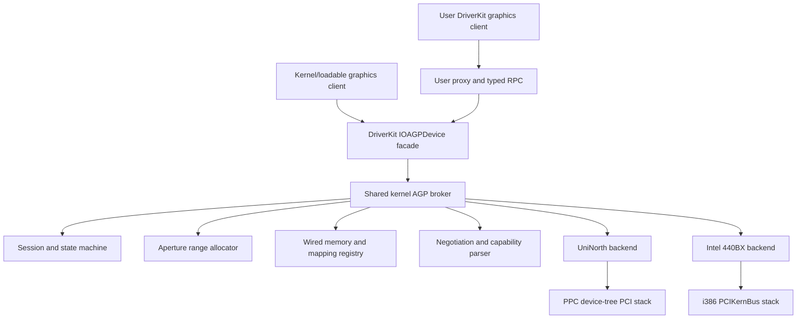

# AGP Bus Support Design

**Date:** 2026-08-01  
**Status:** Approved design  
**Scope:** Shared DriverKit/kernel AGP infrastructure with UniNorth support on PPC and Intel 440BX support on i386

## Summary

RhapsodiOS will add a shared kernel AGP broker, a DriverKit-native client API, and thin chipset backends for Apple UniNorth and Intel 440BX. The broker will own AGP sessions, aperture allocation, wired client memory, GART contents, link negotiation, and rollback. Both kernel/loadable drivers and user-space DriverKit drivers will use the same lifecycle and semantics.

The API will follow the concepts of Apple's later `IOAGPDevice` contract—create and destroy an AGP space, reserve aperture offsets, commit and release memory, query status, and reset—without importing IOKit. User clients will call through a typed DriverKit RPC proxy; kernel clients will call the broker directly.

The first milestone supports AGP 1x and 2x. It enables sideband addressing only when both endpoints advertise it and disables fast writes unconditionally. Real Power Mac G4 Sawtooth and Intel 440BX systems are the hardware acceptance platforms.

## Goals

- Detect a supported AGP host bridge and an AGP-capable graphics master on PPC and i386.
- Publish one AGP service attached to the existing PCI/device-tree graphics device.
- Negotiate a conservative AGP 1.0/2.0 link: 2x preferred, 1x fallback, mutual SBA allowed, fast writes and 4x disabled.
- Create and destroy the chipset aperture and GART.
- Reserve and release aligned ranges within the aperture.
- Wire task-owned memory, translate its pages, commit the pages to the GART, and release them safely.
- Offer equivalent APIs to kernel/loadable and user-space DriverKit clients.
- Reclaim all mappings and hardware state after explicit close, task death, driver unload, or partial failure.
- Verify the shared core and both backends with deterministic host tests, DriverKit harnesses, and real hardware.

## Non-goals

- AGP 3.0, 4x, or 8x operation.
- Fast writes.
- Chipsets other than UniNorth and Intel 440BX in the first milestone.
- Integrating a production ATI, Matrox, or other graphics driver.
- Proving rendered acceleration or master-initiated AGP traffic. A GPU-specific driver is required for that later milestone.
- Replacing either architecture's PCI enumeration model.
- Bootloader changes or unrelated PCI refactoring.
- Suspend/resume support beyond safe disable and reset hooks; the targeted Rhapsody power path does not make sleep a first-milestone acceptance gate.

## Existing System Context

The two architectures expose PCI differently:

- i386 uses the loadable `PCIKernBus` under `src/drivers-i386/bus/drvPCIBus`, with public PCI device-description and direct-device APIs in `src/driverkit-3/driverkit/pci`.
- PPC represents PCI devices through the device tree. `IOPCIDevice` forwards configuration-space access to `IOMacRiscPCIBridge` in `src/driverkit-3/libDriver/ppc`.
- Sawtooth's platform expert currently marks its AGP bridge as compatible with a generic PCI bridge in `PEEditDTEntry()`. This workaround enables enumeration but supplies no AGP negotiation or GART management.
- DriverKit already has `IOMemoryDescriptor` and `IOMemoryContainer` primitives for task-owned ranges, all-or-nothing wiring, physical-page enumeration, and architecture-specific cache checkpoints.
- The existing DriverKit server definition and kernel server machinery already provide the pattern for mapping user requests to kernel-owned resources and reacting to port death.

No existing code owns an AGP aperture, constructs a GART, negotiates AGP command registers, or tracks AGP mappings.

## Architecture

The broker is architecture-neutral. It is the only component allowed to mutate session state, allocate aperture offsets, retain wired client pages, or publish mappings. A chipset backend supplies discovery, aperture-size selection, register access, GART entry encoding, ordering, invalidation, enable/disable, reset, and diagnostic readback.

An AGP graphics master remains an ordinary PCI/device-tree device. AGP support is composed onto that device through an `IOAGPDevice` facade. Existing device descriptions, BAR resources, interrupts, and non-AGP drivers remain unchanged.

The service is published only when all of the following are true:

1. A supported UniNorth or Intel 440BX host bridge is present.
2. The bridge exposes a valid AGP capability.
3. A child graphics master exposes a valid AGP capability.
4. Both sides share at least the 1x transfer-rate bit.
5. The backend can identify a supported aperture configuration.

Malformed capability lists, unsupported chip revisions, or missing endpoint capabilities leave the device as ordinary PCI and produce one diagnostic message; they do not fail PCI enumeration or boot.

## Components

### DriverKit AGP facade

A new architecture-neutral DriverKit header will define:

- AGP status, command, option, and feature flags.
- Opaque 32-bit session, range, and mapping handles. Zero is always invalid.
- The `IOAGPDevice` facade and its public lifecycle methods.
- An `IODirectDevice` convenience category for obtaining the facade associated with the receiver's device description.

The kernel and user libDriver builds will provide separate implementations of the same public facade. The kernel implementation forwards directly to the broker. The user implementation marshals requests to the DriverKit server and never exposes kernel object pointers.

The public operations are:

1. Acquire or release an exclusive AGP session for the master.
2. Create or destroy the AGP space.
3. Reserve or release a page-aligned aperture range.
4. Commit an `IOMemoryDescriptor` at a reserved offset and release it by opaque mapping handle.
5. Query AGP space, negotiated command, counters, and last fault.
6. Reset a disabled or faulted bridge when the backend can verify recovery.

The method naming and option bits will stay close to Apple's later `createAGPSpace`, `destroyAGPSpace`, `commitAGPMemory`, `releaseAGPMemory`, `getAGPStatus`, and `resetAGP` semantics. The design deliberately replaces `getAGPRangeAllocator` with `reserveAGPRange` and `releaseAGPRange`: a live kernel allocator object cannot cross the user DriverKit boundary safely.

### Shared kernel broker

One broker instance exists per supported host bridge. It owns:

- The bridge backend and discovered master.
- The exclusive session and its owning task/port.
- The current state and negotiated AGP command.
- The GART allocation and selected aperture.
- The aperture range allocator.
- Mapping records containing owner, range handle, offset, length, memory descriptor, physical pages, and programmed-entry count.
- Operation counters and the last persistent hardware fault.
- One sleep lock serializing every state-changing operation.

The broker never accepts client-supplied physical addresses. It derives physical pages only from a successfully wired `IOMemoryDescriptor` owned by the caller's task.

### User DriverKit transport

The user proxy serializes the descriptor's logical ranges as copied, out-of-line Mach data and sends the caller's task port. The kernel endpoint converts the task port to the caller's map, copies and validates the range vector, constructs a kernel `IOMemoryDescriptor`, sets its client map, and performs the normal broker commit path.

Every RPC carries a task-scoped opaque handle. The server validates handle type, generation, owning task, bridge, and current state before use. A client cannot use another task's session or mapping even if it guesses a numeric handle.

Port-death notification calls the same teardown routine as explicit session release. No separate emergency cleanup path is permitted.

### UniNorth backend

The PPC backend discovers the UniNorth AGP host and master through the existing device tree and `IOMacRiscPCIBridge` configuration-space path. It owns only chipset-specific policy:

- Recognizing supported UniNorth compatible values and revisions.
- Locating and validating the host and master AGP capabilities.
- Selecting and programming a supported aperture size.
- Programming the GART base and control registers.
- Encoding GART PTEs with correct PPC byte order and address constraints.
- Performing required PPC cache checkpoints, ordering barriers, and GART invalidation/readback.
- Enabling, disabling, resetting, and reporting hardware status.

The existing Sawtooth generic-bridge compatibility edit remains until the new discovery path is proven to enumerate the complete subtree. It will not be removed merely because AGP support exists.

### Intel 440BX backend

The i386 backend discovers the supported Intel 440BX host bridge through `PCIKernBus` and standard PCI configuration space. It owns:

- Matching the supported 440BX host-bridge IDs and revisions.
- Locating and validating host and master AGP capabilities.
- Selecting an aperture size supported by the chipset.
- Programming APBASE, APSIZE, ATTBASE, AGPCTRL, and related enable/invalidate state in the required order.
- Encoding little-endian GART PTEs and enforcing the chipset's physical-address limits.
- Applying required ordering and readback around GART updates.
- Enabling, disabling, resetting, and reporting hardware status.

The backend consumes the existing PCI configuration service. It must not introduce a third copy of i386 PCI configuration-cycle code.

### Test clients

The milestone includes:

- A small loadable/kernel AGP harness using direct facade calls.
- A user DriverKit test utility using the proxy path.
- Diagnostic-only backend hooks, compiled out of release builds, for safe GART entry and register readback during real-hardware acceptance.

Neither harness sends device-specific GPU commands.

## Public Lifecycle and Data Flow

### Session creation

1. The client opens the facade for an AGP master and requests a session.
2. The broker verifies that the service is ready and no owner exists.
3. The broker records the owning task/port and returns a generation-tagged session handle.

Only one session may own a master at a time. Reentrant acquisition by the same task is rejected rather than reference-counted.

### AGP-space creation

1. The client supplies a maximum aperture length and zero options.
2. The broker validates host and master capabilities and asks the backend for the largest supported aperture not exceeding the request.
3. The broker allocates a page-aligned, physically suitable, wired, zeroed GART and initializes every entry as invalid.
4. The backend programs the aperture and GART while AGP traffic remains disabled.
5. The broker intersects target/master queue depth, rate, SBA, and addressing capabilities.
6. It selects 2x if mutual, otherwise 1x; it enables SBA only if mutual; it clears 4x, fast-write, and unsupported addressing bits.
7. The backend programs target and master in its documented order and verifies the resulting state where hardware permits.
8. The broker publishes the actual aperture base, actual length, and negotiated command.

Any failure unwinds to the owned-but-disabled state and leaves no GART allocation behind.

### Range reservation

Reservations use 4 KiB units. Length, alignment, and chosen offset must all fit in 32-bit aperture arithmetic without wraparound. The allocator rejects overlap and returns an opaque range handle plus offset. A range cannot be released while it contains a committed mapping.

### Memory commit

1. Validate the session/range handles, owner, enabled state, alignment, size, aperture bounds, and absence of an existing mapping.
2. Wire the entire descriptor for bidirectional device access. Wiring is all-or-nothing.
3. Resolve every physical page, reject zero/invalid pages and addresses the backend cannot encode, and stage every encoded PTE in temporary broker memory.
4. Under the bridge lock, write the affected GART entries.
5. Perform architecture/backend ordering and one GART invalidation when requested or required.
6. Publish the mapping record and return its opaque handle.

If any step before publication fails, the broker clears any entries already written, performs the required ordering/invalidation, unwires the entire descriptor, and leaves the reservation empty.

### Memory release and teardown

Release validates the mapping owner, clears all of its entries, orders and invalidates the GART, performs the completion cache checkpoint, unwires the descriptor, and deletes the mapping record. Teardown then proceeds in strict reverse order:

1. Release all mappings.
2. Release all aperture reservations.
3. Disable AGP on the master.
4. Disable AGP and the GART on the target.
5. Clear and free the GART.
6. Reset broker allocation state.
7. Release the session owner.

Explicit close, task death, failed create, driver unload, and reset share this implementation.

## State Model and Concurrency

The broker states are:

- **Ready:** supported bridge/master pair published, no owner, link disabled.
- **Owned:** one valid session, link disabled.
- **Enabled:** session owns a configured aperture and active GART.
- **Faulted:** hardware could not be returned to a verified safe disabled state.

All lifecycle and mapping changes hold the bridge sleep lock. Commit/release cannot race destroy/reset, and backend register access happens only while the broker holds this lock. Read-only status calls take the same lock long enough to return a coherent snapshot.

Argument, ownership, resource, and unsupported-feature failures are recoverable and leave the previous stable state intact. A failed required invalidate/readback, an unverifiable disable sequence, or a persistent backend hardware error faults the bridge. A faulted bridge rejects new sessions until backend reset succeeds or the machine reboots.

## Diagnostics

One boot-time line reports:

- Backend name.
- Host bridge and graphics-master identity.
- Aperture base and size.
- Negotiated rate, SBA state, and queue depth.

Routine reserve/commit/release calls do not log. A status query returns counters for sessions, commits, releases, rollbacks, port-death cleanups, resets, and faults, plus the last hardware fault code. Debug builds may enable detailed register/PTE readback for the acceptance harness.

## Verification

### Host-side deterministic tests

- Valid, missing, malformed, and cyclic PCI capability lists.
- Rate selection, SBA intersection, queue-depth intersection, and forced clearing of 4x/fast-write.
- Aperture allocation, alignment, overflow, overlap, exhaustion, and stale-generation handles.
- Fragmented descriptors and backend physical-address rejection.
- UniNorth and 440BX PTE encoding from known physical-page fixtures.
- Backend register sequencing against fake register banks.
- Failure injection at every create, commit, release, and destroy step with exact rollback assertions.
- Competing session, commit, destroy, reset, and status operations.
- Explicit close and simulated port death.

### DriverKit harness tests

The kernel and user harnesses each exercise acquire, create, reserve, commit, status, release, destroy, and reacquire. The user harness additionally verifies stale/cross-task handles and kill-with-live-mappings cleanup.

### Real-hardware acceptance

Both Sawtooth and 440BX machines must pass:

1. With no AGP client, the existing OS boots and ordinary PCI/display behavior is unchanged.
2. Read-only probing identifies the expected host/master capabilities.
3. The harness creates the aperture and verifies the conservative command by configuration/register readback.
4. A descriptor containing discontiguous wired pages is committed; diagnostic GART readback exactly matches expected PTEs.
5. Release clears every entry and returns the wired-page count to baseline.
6. Repeated create/map/unmap/destroy cycles show no growth in wired pages, ranges, mappings, or handles.
7. Killing the user harness with live mappings reclaims all resources, disables the link, and permits a new session.
8. Invalid/misaligned requests and injected recoverable failures leave the bridge usable.
9. The machine reboots normally after stress, and ordinary PCI/display behavior still works.

These gates validate AGP infrastructure and hardware programming. Actual GPU-initiated aperture traffic remains a later graphics-driver integration gate.

## Compatibility and Rollout

- Existing PCI APIs and non-AGP drivers retain their behavior and ABI.
- New public DriverKit structures use fixed-width 32-bit fields and reserved padding suitable for both ppc and i386.
- Opaque handles prevent user code from depending on kernel object layout.
- AGP is dormant until an explicit client acquires a session and creates a space.
- Unsupported hardware remains ordinary PCI and does not block boot.
- The shared broker and fake backends land before either real backend can enable hardware.
- Each backend first lands in read-only discovery mode, then gains GART programming behind the test harness, and only then enables link negotiation on real hardware.

## Source References

- `src/driverkit-3/driverkit/IOMemoryDescriptor.h`
- `src/driverkit-3/driverkit/IOMemoryContainer.h`
- `src/driverkit-3/libDriver/driverServer.defs`
- `src/driverkit-3/driverkit/pci/IOPCIDeviceDescription.h`
- `src/driverkit-3/driverkit/pci/IOPCIDirectDevice.h`
- `src/driverkit-3/driverkit/ppc/IOPCIDevice.h`
- `src/driverkit-3/libDriver/ppc/IOPCIDevice.m`
- `src/driverkit-3/libDriver/ppc/IOMacRiscPCI.h`
- `src/kernel-7/driverkit/i386/PCIKernBus.h`
- `src/drivers-i386/bus/drvPCIBus`
- `src/drivers-ppc/bus/drvPExpert/powermac/identify_machine.c`
- [Apple's later `IOAGPDevice` interface](https://github.com/apple-oss-distributions/IOPCIFamily/blob/main/IOKit/pci/IOAGPDevice.h)

## Success Criteria

The milestone is complete when the shared core, user transport, both backends, and both harnesses pass their deterministic tests; the repository builds for ppc and i386; and the complete real-hardware acceptance matrix passes on Sawtooth and Intel 440BX without regressing ordinary PCI or display operation.
